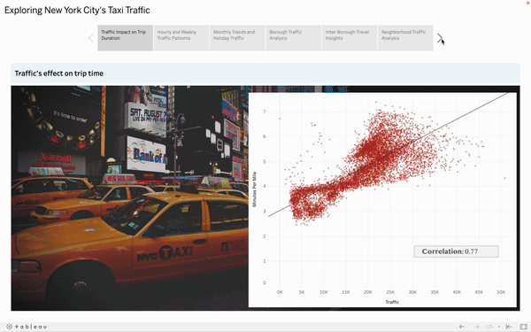
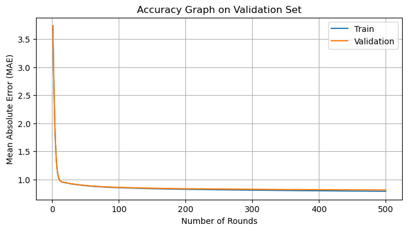
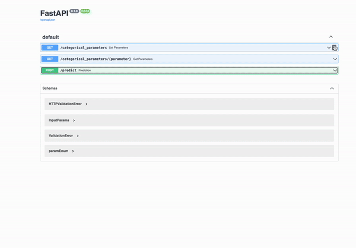
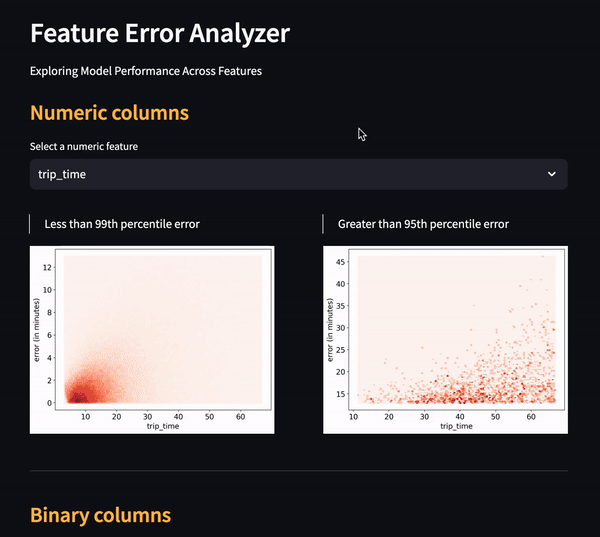

[](https://github.com/ellerbrock/open-source-badges/)
[](https://afnanurrahim-new-york-eta.hf.space/docs)


## Authors

- [@afnanurrahim](https://github.com/afnanurrahim)

## Table of Contents

  - [Business problem](#business-problem)
  - [Data source](#data-source)
  - [Tech Stack](#tech-stack)
  - [Pipeline](#pipeline)
  - [Tableau Visualization](#tableau-visualization)
  - [Results](#results)
  - [Lessons learned](#lessons-learned)
  - [Limitation and what can be improved](#limitation-and-what-can-be-improved)
  - [API Tutorial](#api-tutorial)
  - [App deployed on FastAPI](#app-deployed-on-fastapi)
  - [Prediction error analyzer](#prediction-error-analyzer)
  - [Repository structure](#repository-structure)
  - [License](#license)

## Business problem

This FastAPI web application aims to predict the estimated time of arrival (ETA) for New York City taxis in 2021. The prediction is based on factors such as the hour of the day, traffic conditions, holidays, weather etc. providing valuable insights for taxi service optimization.
___
## Data source
- [TLC Trip Record Data](https://www.nyc.gov/site/tlc/about/tlc-trip-record-data.page)
- [Hourly weather Dataset](https://mesonet.agron.iastate.edu/request/download.phtml?network=NY_ASOS)
___
## Tech Stack
- Python
- FastAPI  (For building the api)
- Streamlit  (For error analyzer web app)
- Tableau    (For Data visualization)
- Hugginface   (For web app deployment)
___
## Pipeline
- Defining problem statement
- Data collection
- Sampling
- EDA
  - Data cleaning
  - Feature engineering
  - Uni, bi and multivariate analysis
  - Hypothesis testing
  - Feature selection
  - Data visualization
- Model building
- Visualization of prediction
- Deployment
___
## Tableau Visualization



[](https://public.tableau.com/views/Newyorkstaxitraffic/Story1?:language=en-US&:display_count=n&:origin=viz_share_link)
___
## Results
**Mean Absolute Error for training and validation set**



XGBoost vs Linear Regression
> Comparing result of Xgboost with a simple linear regression model on trip_time vs trip_miles

| Model     	                | MAE (in minutes)|
|-------------------	        |-----------------|
| Linear Regression         	| 4.77 	          |
| XGBoost               	    | 2.60 	          |

**Percentage Improvement:**
=  $$\frac{LinearRegression − XGBoost}{LinearRegression} * 100 = \frac{4.77 - 2.6}{4.77} * 100  = 45.4$$
We can see there is a **45%** improvement in result.

- **The final model used for this project: XGBoost**
- **Why I chose XGBoost**:
  - **Handling non-linear relationships**: XGBoost effectively models complex, non-linear relationships between predictor variables (e.g., traffic conditions, weather) and the target variable (ETA), capturing intricate interactions.
  - **Robustness to outliers**: XGBoost's ensemble learning approach mitigates the impact of outliers by averaging their effects across multiple weak learners, ensuring robust predictions.
  - **Performance on large data**: XGBoost's optimized implementation and parallel processing capabilities enable efficient training and prediction on extensive datasets, maintaining high performance without compromising speed or memory efficiency.

- **Why I chose MAE as metrics**:
  Mean Absolute Error (MAE) is a suitable metric for ETA prediction because it provides a clear interpretation of the average magnitude of errors in the predicted ETA values. Additionally, MAE is robust to outliers and provides a more balanced view of prediction errors compared to other metrics like Mean Squared Error (MSE), which penalizes larger errors more heavily.

> Another reason why I chose MAE as a metric is because of a research paper published by Uber titled:

>  "DeepETA: How Uber Predicts Arrival Times Using Deep Learning"
___
## Lessons learned
- **Defining the target column is crucial**: Choosing the right target variable, such as using "minutes per mile" instead of "trip time," ensures a more accurate analysis of the relationship between features like weather and traffic with trip duration.
- **Data understanding is essential**: A thorough understanding of the dataset helps in efficient analysis during Exploratory Data Analysis (EDA), ultimately saving time and effort.
- **Handling big data challenges**: Spark's data processing limitations necessitated processing large datasets in batches. This approach helped manage data size efficiently.
- **Efficient feature selection strategies**: Traditional feature selection methods were time-consuming for large datasets. Sampling data and utilizing filter-based feature selection methods proved effective in handling skewed data and optimizing feature selection process.
___
## Limitation and what can be improved
- **Enhanced traffic data integration**: Implementing predictive models to forecast traffic conditions could enrich the app's analysis and provide more accurate insights into factors affecting trip durations.
- **Expansion to ride pricing prediction**: Extending the app's functionality to predict ride prices across multiple platforms such as Uber, Via, and Lyft would offer users comprehensive information for informed decision-making regarding transportation choices.
___
## API Tutorial
```python
import requests

# Example parameters
parm = {
  "taxi_company": "Uber", "trip_miles": 5.5, "wav_request_flag": False, "wav_match_flag": True, "dispatching_base_num": "B02512",
  "PULocationID": 3, "DOLocationID": 258, "any_tolls": True, "hour_of_day": 13, "day_of_week": "Monday", "month": "May",
  "traffic": 1000, "feel": 20, "humidity": 83, "BR": True, "CLR": True, "SN": True, "wind_speed": 20, "wind_direction": "N"
}

response = requests.post('https://afnanurrahim-new-york-eta.hf.space/predict', json= parm)
print(response.json())

# Output:
# 18.61781597137451

```
___
## App deployed on FastAPI


[](https://afnanurrahim-new-york-eta.hf.space/docs)

___
## Prediction error analyzer


[](https://afnanurrahim-model-error-analyzer.hf.space)
___
## Repository structure
```

├── 4_ETA
│   ├── 1_weather_EDA.ipynb                         <- EDA on New York's hourly weather data.
│   ├── 2_combine_parquet.ipynb                     <- Combining monthly trips data.
│   ├── 3_trips_EDA.ipynb                           <- EDA on trips along with combining all dataset into one.
│   ├── 4_Uni_Bi_Multivariate_analysis.ipynb        <- Analysis on variables relationship.
│   ├── 5_feature_selection.ipynb                   <- Feature selection techniques.
│   ├── 6_Data_visualization_Tableau.ipynb          <- Data preparation for Tableau.
│   ├── 7_Model_building.ipynb                      <- Building model for prediction
│   │
│   ├── FastAPI                           
│   │   ├── Dockerfile                              <- Docker file
│   │   ├── Features.py                             <- Class for assistance of main.py
│   │   ├── main.py                                 <- Contains the FastAPI web app
│   │   ├── get_categorical_values.ipynb            <- Getting label encoded values used in ML model
│   │   ├── requirements.txt                        <- FastAPI dependencies
│   │
│   ├── Model_dashboard
│   │   ├── prediction_dataset.ipynb                <- creating dataset for analyzing predictions
│   │   ├── app.py                                  <- Streamlit app that analyze error with independent variables. 
│   │
│   ├── Tableau                           
│       ├── borough_info.csv                         <- Contains traffic info about each Borough
│       ├── borough_path.csv                         <- Contains info about inter Borough trips 
│       ├── location_info.csv                        <- Contains traffic info about different neighborhoods in NYC
│       ├── time_only.csv                            <- Info of traffic based on weekdays, hour of day, month, etc.
│   
├── Media
│   ├── Api.gif                                      <- FastAPI app gif
│   ├── Banner.png                                   <- README file banner
│   ├── MAE.png                                      <- Train and validation set mean absolute error
│   ├── error_analyzer.gif                           <- Error analyzer web app gif 
│   ├── tableau.gif                                  <- Tableau dashboard gif
│
│
├── 1_Data_Exploration.ipynb                         <- Basic overiew on dataset
│
│
├── 2_Sampling.ipynb                                 <- Sampling on the large dataset 
│
│
├── 3_population_vs_sample.ipynb                     <- Comparison of population vs sampled data
│
│
├── LICENSE                                       <- license file.
│
├── README.md                                     <- this readme file.

```
___
## License
MIT License

Copyright (c) 2024 afnanurrahim

Permission is hereby granted, free of charge, to any person obtaining a copy
of this software and associated documentation files (the "Software"), to deal
in the Software without restriction, including without limitation the rights
to use, copy, modify, merge, publish, distribute, sublicense, and/or sell
copies of the Software, and to permit persons to whom the Software is
furnished to do so, subject to the following conditions:

The above copyright notice and this permission notice shall be included in all
copies or substantial portions of the Software.

THE SOFTWARE IS PROVIDED "AS IS", WITHOUT WARRANTY OF ANY KIND, EXPRESS OR
IMPLIED, INCLUDING BUT NOT LIMITED TO THE WARRANTIES OF MERCHANTABILITY,
FITNESS FOR A PARTICULAR PURPOSE AND NONINFRINGEMENT. IN NO EVENT SHALL THE
AUTHORS OR COPYRIGHT HOLDERS BE LIABLE FOR ANY CLAIM, DAMAGES OR OTHER
LIABILITY, WHETHER IN AN ACTION OF CONTRACT, TORT OR OTHERWISE, ARISING FROM,
OUT OF OR IN CONNECTION WITH THE SOFTWARE OR THE USE OR OTHER DEALINGS IN THE
SOFTWARE.
